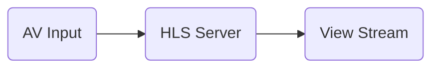

In the future, you'll likely notice that a lot of my posts will be related to streaming technologies. I think this ongoing pandemic has caused me to think more about streaming  since it seems to be the most common way that people are killing time. Whether it's netflix, hulu, disney+ etc, people are putting plenty of hours into these services, so much so that some services are having to [reduce streaming bitrates to handle the load](https://techcrunch.com/2020/03/20/amazon-follows-netflixs-lead-reducing-streaming-quality-in-europe/). With everyone practicing social distancing, we're also seeing a huge surge in video conferencing services from the likes of Zoom and Skype, as reflected in the iOS App Charts this week.

Regardless of all of this, I've accepted that my next project over the coming weeks will be developing my own live-streaming application on iOS. I'll elaborate more on what I plan to do with it in the coming weeks, but in this post, I'll cover the process of setting up an HLS server, which a critical component for this application.



The reason we need an HLS server is so that we can serve the content we stream to viewers. Without it, it wouldn't be possible to stream our to users. As demonstrated in the flow chart above, we start with an AV source, which could be something simple like the webcam and microphone on my Macbook. We then push the content provided by this input sources to our HLS server, which formats the content for HLS enabled viewing. With the server running and content being pushed to the server, end users can now view the stream by visiting the stream url provided by the server.

The rest of this post outlines how I created and tested a basic HLS streaming server using nginx and Docker. The idea is that I plan on using this server in the future in addition to the iOS app that I'll be making. Let's get to it.

When I was researching how I was going to configure this server, I came across a few really helpful resources that simplified the entire process. One was this [outdated guide from peer5](https://docs.peer5.com/guides/setting-up-hls-live-streaming-server-using-nginx/) and another was this [youtube video](https://www.youtube.com/watch?v=Y-9kVF6bWr4) which basically was a live walkthrough of the guide provided by peer5. 

While both resources were incredibly useful, they both wanted me to launch my own server in the cloud to deploy on. I was more interested in a portable solution with docker. Through some trial and error I came up with the following Dockerfile:

```
FROM ubuntu:18.04

RUN apt-get -y update; \
	apt-get -y upgrade; \
	apt-get install -y build-essential libpcre3 libpcre3-dev libssl-dev curl git wget zlib1g zlib1g-dev vim;

EXPOSE 8080
EXPOSE 80
EXPOSE 1935
EXPOSE 443

WORKDIR /home/

RUN git clone https://github.com/sergey-dryabzhinsky/nginx-rtmp-module; \
	wget http://nginx.org/download/nginx-1.17.3.tar.gz; \
	tar -xf nginx-1.17.3.tar.gz; \
	rm -rf nginx-1.17.3.tar.gz; \ 
	cd nginx-1.17.3/; \
	./configure --with-http_ssl_module --add-module=../nginx-rtmp-module;\
	make; \
	make install; \
	mv /usr/local/nginx/conf/nginx.conf /usr/local/nginx/conf/nginx.conf.original; \
	mkdir -p /nginx/hls

COPY nginx.conf /usr/local/nginx/conf/

CMD ["/usr/local/nginx/sbin/nginx", "-g", "daemon off;"]
```

It's a fairly straightforward dockerfile, but I'll go over it briefly:

- I used ubuntu:18.04 as the base image since ubuntu is what I am most familiar with.
- I installed all the packages that are required to build nginx from source. It needs to be built from source in order to take advantage of the third party rtmp module that I needed.
- I exposed ports 8080, 80, 1935 and 443. 
  - Port 443 is for secured http traffic and to my understanding is needed here but it was added when trying to debug container networking issues that I previously experienced. 
  - Port 80 is the default web traffic port. While exposed on this container, I actually ran the nginx webserver on port 8080, so this was also an unnecessary entry.
  - Port 1935 is the standard rtmp port. This is where the streamer streams his/her content to.
  - Port 8080 is where nginx serves the stream to viewers. 
- The rest of the steps build nginx from source with the third party module that I needed. I also needed to copy in the `nginx.conf` file in order to configure nginx to do exactly what I wanted.

Now would be a good time to say that if you'd like to follow along with the source code, you can find it here:

https://github.com/nickshields/nginx-hls-streaming

With the Dockerfile in place, I simply ran `docker build .` to build the image and then I was able to run it using `docker run -P <built_container_id>`. In a new terminal, run `docker ps` to see how the ports are mapped between the container and your machine:

```
bed62348a9e2        62145265fd6a                                  "/usr/local/nginx/sb…"   About a minute ago   Up About a minute   0.0.0.0:32780->80/tcp, 0.0.0.0:32779->443/tcp, 0.0.0.0:32778->1935/tcp, 0.0.0.0:32777->8080/tcp   dazzling_khorana
```

So now comes the fun part. Let's test it.

As stated earlier, I need to stream some content to port 1935 in the container, which is mapped to port 32778 on my host machine. I downloaded [OBS](https://obsproject.com/download), since this is the most trivial way I could think to test it out. In OBS, I set the the stream settings as follows:


Notes:

- The stream server is rtmp://127.0.0.1:32778/show. The /show corresponds with the application name configured in ngnix under the rtmp configuration. When we stream our content to this url, it encodes in hls format and stores the streaming fragments under /ngnix/hls/. 
- The stream key was set to `test`. While I thought this had no significance at first, it turns out that the steam key ends up being the name of the stream that your end users will need to know in order to see your stream.

With OBS configured, it was as easy as starting the stream, and everything began working. Now in order for me to view the stream, all I had to do was navigate to http://127.0.0.1:32777/hls/test.m3u8 and voila:

{: .center-block :}

The latency is pretty noticable in the stream, but I imagine that there's some settings I can tweak to improve it.

That concludes it folks! An HLS livestreaming server through nginx. If you have docker, check out the [source code](https://github.com/nickshields/nginx-hls-streaming) and build it yourself. I did all the heavy lifting so that you don't have to :)


Cheers!

-Nick

